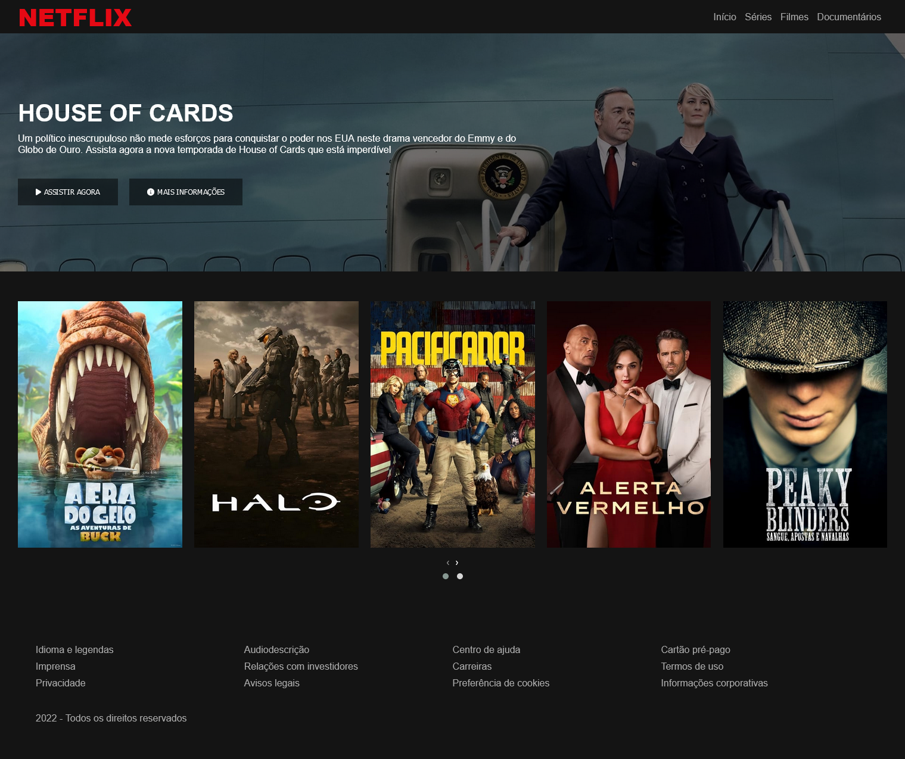

# Netflix-Clone

## Overview

### Screenshot

### Links

-   Solution URL: https://viniciusdsv93.github.io/Netflix-Clone/

## My process

### Built with

-   Semantic HTML5 markup
-   CSS custom properties
-   JavaScript

### What I learned

In this project i could use JavaScript features and CSS to clone a Netflix home page, with a carousel to show the movies and series.

## Author

-   GitHub - Vinícius dos Santos Verissimo (https://github.com/viniciusdsv93)
